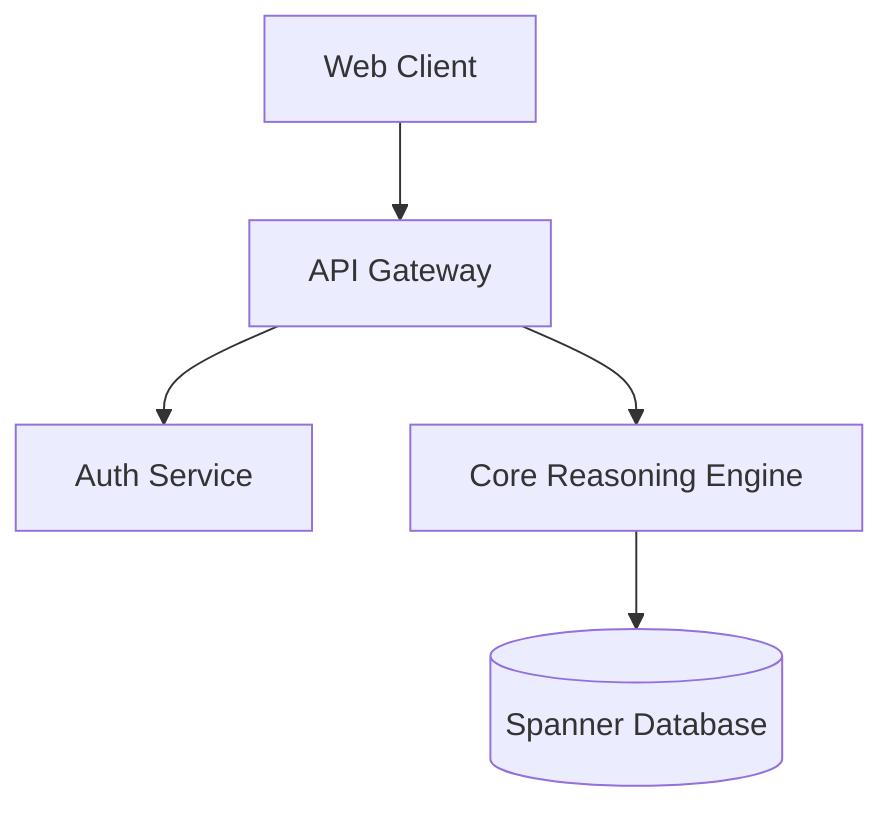

# System Architecture Specification

This is an example document demonstrating **md2pdf** formatting capabilities.

---

## 1. Executive Summary

| Capability | Specification |
| :--- | :--- |
| **Engine** | ReportLab + Mermaid.ink API + Pillow |
| **Output** | Publication-quality PDF with running headers & footers |
| **Platform** | Headless Linux (Cloudtop, servers) & macOS |

---

## 2. Architecture Diagram

---

## 3. Key Invariants

> [!NOTE]
> All services run in zero-trust VPC perimeters with mutual TLS.

* **High Availability**: Regional multi-zone deployment.
* **Telemetry**: Distributed tracing enabled on all endpoints.
